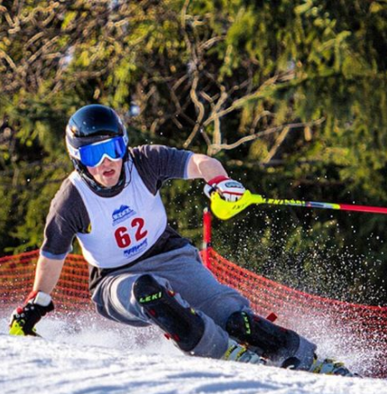

<style> 
body{
background: linear-gradient(#cccccc, #ffffff);
}
</style>

<font color="black"><font size=4><font face="Cambria"> I am currently a first-year graduate student at Columbia's Mailman School of Public Health in the Biostatistics department. I graduated from SUNY Binghamton University with a BS in Biology and Economics in 2017. I am originally from Syracuse, New York, and currently live in New York City while attending Columbia. </font>  

<br>

##Technical Skills
<font color="black"><font size=4><font face="Cambria"> I have previous experience using R, SAS, and Stata, as well as Git and Github for collaborative projects. I am also in the process of learning SQL, and am interested in learning Python for future endeavors. </font>
<br>
   
 
<br>
 
##Hobbies and other Interests
<font color="black"><font size=4><font face="Cambria"> Outside of student life, I like to spend my time at the gym (lifting, swimming, recreational sports, even a little boxing) or playing/listening to music (I play drums and guitar!).  
I also love to ski, having raced since I was young. In college, I raced for the Binghamton University ski team. Since graduating, I help out with the coaching staff when I am around. </font> 


```{r, out.width = "200px", echo=FALSE}

```
<font face="Cambria"><font size=3> Mid-race at Holiday Valley in Buffalo, NY. Might have forgotten my suit that day! </font>

<br> <font size=3> One of my favorite comics, courtesy of XKCD </font>
<br>

